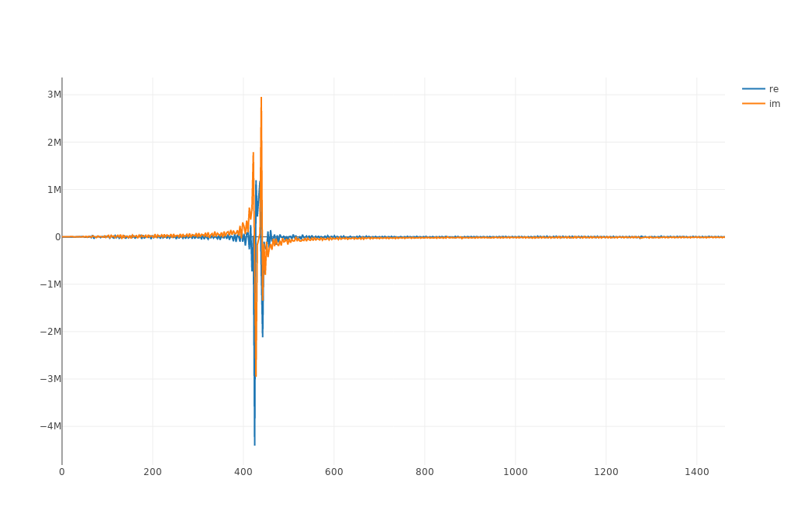
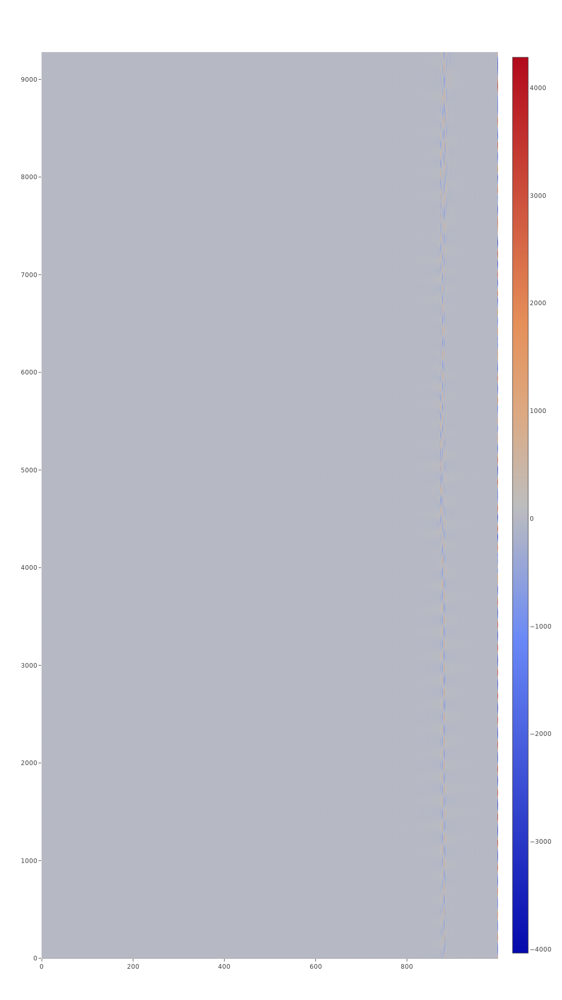

# Plot frequencies of audio files

This is done by Fourier transforming wave forms represented as vectors of intensity over time.

## Example plot
Plot of 440hz tone and an almost 440hz tone, recorded with real equipment.

Heat map of frequencies in entire audio file for flute playing an A tone at 5th octave.

## Resources
- [unic0nr9k fourier notebook](https://nbviewer.org/github/unic0rn9k/fourier-notebook/blob/master/README.ipynb)
- [unic0rn9k sfft](https://github.com/unic0rn9k/sfft)
- [unic0rn9k num](https://github.com/unic0rn9k/num)
- [plotly](https://github.com/igiagkiozis/plotly)
- [minimp3](https://github.com/germangb/minimp3-rs)
